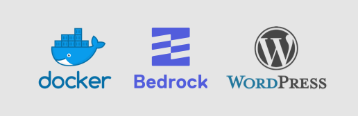

# WLSN Bedrock Docker
Enkel [Docker](https://www.docker.com/) setup för lokal utveckling av [Bedrock](https://github.com/roots/bedrock) baserade [Wordpress](https://wordpress.org/) projekt

### Förberedelser
För att peka .docker domäner mot 127.0.0.1 använder man enklast Dnsmasq på Mac för att skapa en omvänd proxy. Detta installerar man enkelt såhär:

1. Installera med brew: `brew install dnsmasq`
2. Skapa etc katalogen om nödvändigt: `mkdir -p /usr/local/etc`
3. Skapa en enkel konfiguration där alla .docker domäner pekar mot 127.0.0.1: `echo "address=/.docker/127.0.0.1" > /usr/local/etc/dnsmasq.conf`
4. Installera deamon-startup filen: `sudo cp -fv /usr/local/opt/dnsmasq/*.plist /Library/LaunchDaemons`
5. Starta den: `sudo launchctl load /Library/LaunchDaemons/homebrew.mxcl.dnsmasq.plist`
6. Berätta för resolvern att använda Dnsmasq för .docker domäner: `sudo mkdir -p /etc/resolver`, och sedan: `sudo sh -c 'echo "nameserver 127.0.0.1" > /etc/resolver/docker'`

## Användning

### Första setup
1. `git clone git@github.com:Wilsoncreative/wlsn-docker.git your-project`
2. `cd your-project`
3. Ändra `PROJECT_NAME=wlsn-docker` i Makefile till ditt projakts namn (använd [kebab-case](https://stackoverflow.com/questions/11273282/whats-the-name-for-hyphen-separated-case/12273101#12273101) eftersom detta också blir din lokala utvecklingsdomän)
4. Kör `make up` och följ instruktionerna
5. Ditt nya projekt skall starta och du får URLer för att komma åt de olika miljöerna och kan nu installera Wordpress

### Utveckla
Kör `make serve` för att kompilera assets i utvecklingsformat och bevaka filändringar

Kör `make prod` för att kompilera assets i produktionsformat (körs i livemiljön)

Kör `make dev` för att kompilera assets i utvecklingsformat

Kör `make npm [kommando]` för att använda npm i temamappen

### Starta, stoppa osv...
Kör `make up` för att starta allt

Kör `make stop` för att stoppa allt

Kör `make restart` för att starta om allt

Kör `make rebuild` för att bygga om allt från grunden (databas kommer att försvinna om du inte gör backup)

### Använda Composer
Vi abstraherar Composer till en container. Du kan köra `make composer` som du skulle köra `composer` i vanliga fall:

    # Installera en WordPress-plugin:
    make composer require wpackagist-plugin/wp-mail-smtp

    # Uppdatera WordPress & Plugins:
    make composer update

### Gör backup av databas
Kör `make mysql-backup` skapar en komprimerad backup av din databas i backup. Om du behöver en mer konfigurerad backup kan du använda phpMyAdmin

### Återställ en databas
Använd phpMyAdmin för att återställa en databas eller `make mysql-restore` om du skapade en backup nyligen

### Uppgradera utvecklingsmiljö, för att få nya makefunktioner och liknande
Kör `make update`

### Uppgradera projekt & utvecklingscontainer
Kör `make upgrade`

### Loggning & information
Kör `make logs` eller `make logs app` för alla loggarna av dina specifika containrar

Kör `make state` för att se aktuell status för dina container

Kör `make urls` för att se projektets URLer

### Komma åt container
Kör `make ssh app` eller `make logs web` för att komma åt specifika container

### Ta bort behållarna
Kör `make destroy`

### Deployment på Forge
Använd [denna](http://git.wilsonnetwork.se/snippets/3) config för att deploya på forge. Byt ut `YOUR-SITE-FOLDER` & `YOUR-THEME-FOLDER` på alla förekommande ställen
